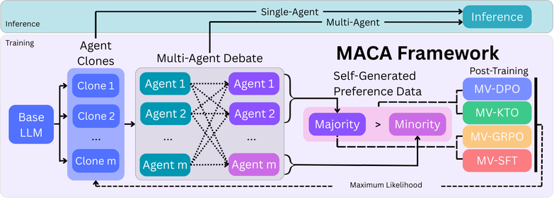

# MACA: Multi-Agent Consensus Alignment

*Internalizing Self-Consistency in Language Models through Multi-Agent Debate*



## Overview

MACA trains language models to be more consistent reasoners through multi-agent debate and consensus-based reinforcement learning.

**Key Features:**
- 🤖 **Multi-Agent Debate**: Orchestrate debates between agents for improved reasoning
- 🎯 **Consensus Training**: Post-train on debate outputs using agreement patterns as rewards
- ⚡ **Distributed Processing**: Multi-GPU parallel training with QLoRA adapters
- 📊 **Analysis Tools**: Built-in performance tracking and visualization

## Quick Start

### Installation

```bash
conda create -n maca python=3.12
conda activate maca
pip install -r requirements.txt
pip install -e .
```

### Multi-Agent Training

```bash
python main.py --model qwen2b --dataset gsm8k --gpus_per_model 1 --max_concurrent_tasks 4 --train_size 1500 --test_size 500 --lora_r 128 --lora_alpha 128 --dpo --epoch_dpo 3 --batch_dpo 6 --lr_dpo 1e-5 --beta_dpo 0.1 --gradient_accumulation_steps_dpo 4 --seed 1
```

### Single-Agent Training
```bash
python maca_single_agent.py --output_dir q2b_sa_runs --model qwen2b --phase kto --kto --train_datasets math gsm8k mathqa --test_datasets math gsm8k mathqa svamp gpqa csqa --use_full_test --lora_r_range 64 --lora_alpha_range 64 --lr_kto 1e-5 --evaluation_batch_size 24
```

### Key Arguments

- `--model`: Base model to use (mistral7b, llama1b/3b/8b, phi4b, qwen2b/7b, gemma4b)
- `--dataset`: Training dataset (gsm8k, math, gpqa, svamp, mathqa, csqa, arithmatic, aime_amc)
- `--agents`: Number of agents in the debate (default: 3)
- `--iterations`: Training iterations (default: 1)
- `--finetune`: Enable supervised fine-tuning (SFT)
- `--post_train`: Enable reinforcement learning post-training (GRPO)
- `--dpo`: Enable Direct Preference Optimization training
- `--kto`: Enable Kahneman-Tversky Optimization training
- `--use_consensus_reward`: Enable consensus-based rewards
- `--use_quantization`: Enable model quantization for memory efficiency
- `--use_scheduler`: Enable intelligent adapter scheduling (recommended)

## Project Structure

```
maca/
├── main.py                    # Main training entry point
├── maca_single_agent.py       # Single agent hyperparameter tuning and testing
├── model.py                   # Agent implementation and reward functions
├── debate.py                  # Multi-agent debate orchestration
├── orchestrator.py            # Training coordination and management
├── data.py                    # Dataset loading and preprocessing
├── parser.py                  # Answer parsing and grading utilities
├── args.py                    # Command-line argument definitions
├── utils.py                   # Utility functions and helpers
├── scheduler.py               # Dynamic job scheduling for adapters
├── train_agent_subprocess.py  # Subprocess training management
├── analyze_experiment_performance.py  # Performance analysis tools
├── read_debate_performance.py # Debate results analysis
├── analysis/                  # Additional analysis scripts
├── data/                      # Dataset storage and splits
├── experiments/               # Experiment outputs and results
└── checkpoints/              # Model checkpoints and adapters
```

## Training Methods

Built on **Hugging Face TRL**, supports multiple paradigms with majority vote variants:
- **MV-SFT**: Supervised fine-tuning on consensus examples
- **MV-GRPO**: Reinforcement learning with consensus rewards  
- **MV-KTO/DPO**: Preference optimization methods

See `args.py` for complete argument documentation.

## Citation

If you use this framework in your research, please cite:

```bibtex
@misc{samanta2024maca,
  title={Internalizing Self-Consistency in Language Models: Multi-Agent Consensus Alignment},
  author={Ankur Samanta and Akshayaa Magesh and Youliang Yu and Runzhe Wu and Ayush Jain and Daniel Jiang and Boris Vidolov and Paul Sajda and Yonathan Efroni and Kaveh Hassani},
  year={2024},
  eprint={2509.15172},
  archivePrefix={arXiv},
  primaryClass={cs.AI},
  url={https://doi.org/10.48550/arXiv.2509.15172},
  note={¹Meta AI, ²Meta Superintelligence Labs, ³Columbia University. *Work done at Meta, †Joint last author, alphabetical order}
}
```